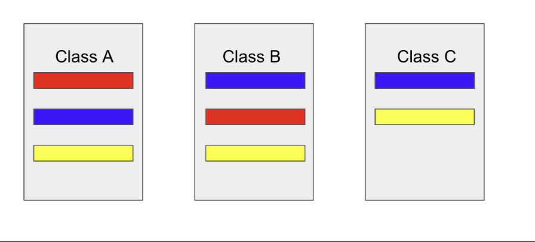
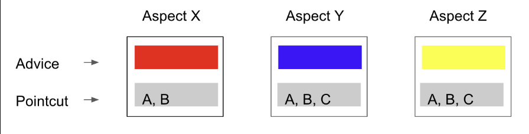

# Spring AOP

## AOP 란?

흩어진 Aspect들을 모아서 모듈화 하는 기법이다.

>서로 다른 클래스라고 하더라도 비슷한 기능을 하는 부분(ex 비슷한 메서드, 비슷한 코드)이있다. 이 부분을 Concern이라고 한다.

이 때 만약 노란색 기능을 수정하여야하면, 각각 클래스의 노란색 기능을 수정해주어야 하기 때문에, 유지 보수 면에서 불리하다.

이것을 해결한 방법이 AOP이다.

흩어진 기능들을 모을 때 사용하는 것이 Aspect이다. 각각 Concern 별로 Aspect를 만들어주고, 어느 클래스에서 사용하는 지 입력해주는 방식이다. 아래의 그림이 Aspect로 모듈화 한 것을 보여주는 것이다.

각 모듈에는 Advice와 Pointcut이 들어있다.

Advice란 해야할 일, 기능을 나타내는 것이다.
Pointcut이란 어디에 적용해야하는지를 나타내는 것이다.(ex A라는 클래스의 W라는 메서드)

Target이라는 개념도 있는데, Target이란 각각 클래스를 나타내는 것이다.(클래스 A, B, C) 즉, 적용이되는 대상을 뜻하는 용어이다.

>Join point라는 용어는 끼어들 지점을 뜻한다

## AOP 적용방법
만약 Class A에 Perf라는 메서드가 있고, Hello라는 Aspect가 있고, Class A의 Perf메서드가 실행 되기 전에 항상 Hello를 출력해야한다고 가정한다.

1. 컴파일 타임
- AspectJ가 사용

자바 파일을 클래스파일로 만들 때, 바이트 코드들을 조작하여, 조작된 바이트 코드들을 생성

>즉, A.java 파일이 A.class로 변환될 때, A.class 파일에 Hello를 출력하는 메서드가 포함되어 있어야한다.

2.  로드 타임
AspectJ가 사용

A.java는 순수하게 A.class로 컴파일 되었지만, A.class를 로딩하는 시점에 Hello를 출력하는 메서드를 끼워넣는 방법이다.

>즉, A의 바이트코드는 변함이 없지만, 로딩하는 JVM 메모리 상에서는 Perf라는 메서드 전에 Hello를 출력하는 메서드가 같이 포함된 상태로 로딩이 되는 것ㅇ디ㅏ.

3. 런타임
스프링 AOP가 사용하는 방법이다.

A라는 Bean(Class A를 뜻함)을 만들 때(spring 어플리케이션에서 Bean을 만드는 과정은 런타임이다.), A라는 타입의 프록시 Bean을 만든다.
이 프록시 Bean이 실제 A가 가지고 있는 Perf라는 메서드를 호출하기 직전에 Hello를 출력하는 일을 하고, 그 다음에 A를 호출한다.
