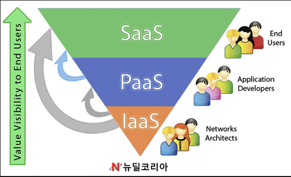

# AWS

## AWS란?
>aws는 Amazon Web Services의 약자로, 아마존닷컴에서 운영하는 Cloud Computing Platform이다. 다른 웹사이트나 클라이언측 응용 프로그램에 대해 온란인 서비스르 제공하는 있다.

## 클라우드 컴퓨팅?

클라우드 컴퓨티은 IT리소스를 인터넷을 통해 오디맨드로 제공하고, 사용한 만큼 지불하는 것이다.

>온디맨드 서비스는 우리말로 주문형 서비스라고 한다.
>고객의 요구가 있을때 언제 어디서나 고객중심에서 니즈를 해결해 주는것이다.
> 쉽게 얘기하면 "내가 있는 곳으로 상품이나 서비스가 찾아온다." 하고 할 수 있다.

클라우드 컴퓨팅 서비스의 종류로는 3가지가 있다.

1. IaaS(Infrastructure as a Service)
2. PaaS(Platform as a Service)
3. SaaS(Software as a Serviece)

### IaaS(Infraxtructure as a Service)
