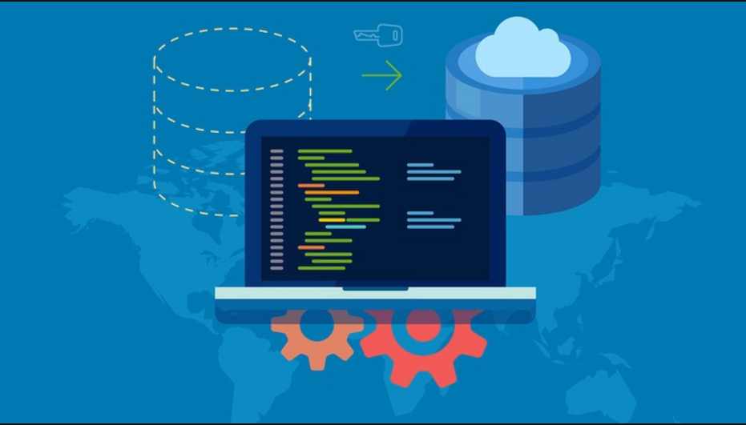
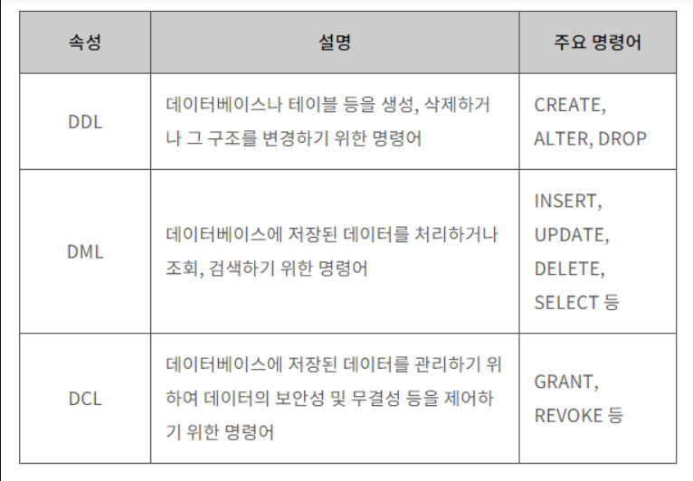

# [Database] 데이터베이스

## 데이터베이스란?
>데이터베이스는 통합하여 관리되는 데이터의 집합체를 의미한다. 이는 중복된 데이터를 없애고, 자료를 구조화하여,효율적인 처리를 할 수 있도록 관리된다.

## DBMS란?
- DBMS란 사용자와 데이터베이스 사이에서 사용자의 요구에 따라 정보를 생성해주고 데이터베이스를 관리할 수 있게 해주는 소프트웨어입니다.
- DBMS는 데이터베이스의 구성, 접근방법, 유지관리에 대한 모든 책임을 집니다.

## 데이터베이스의 특징
1. 사용자의 질의에 대하여 즉각적인 처리와 응답이 이루어집니다.
2. 생성, 수정, 삭제를 통하여 항상 최신의 데이터를 유지합니다.
3. 사용자들이 원하는 데이터를 동시에 공유할 수 있습니다.

## SQL
- SQL은 데이터베이스에서 데이터를 정의,조작,제어하기 위해 사용하는 언어이다.
- 따라서 SQL구문도 위의 목적에 맞게 크게 세 가지로 구분할 수 있습니다.
1. DDL
2. DML
3. DCL
