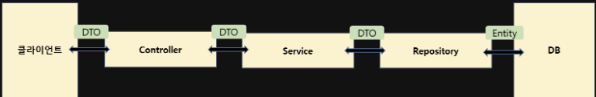

# Entity와 Dto

## 📌 Entity란?

>Entity란 실제 DB에 매칭되는 클래스를 의미한다. 주로 @Entity, @Getter, @ID, @Column의 어노테이션을 사용하였다, 이떄 특징은 Entity클래스의 값을 함부로 세팅 할 수 없게 @Setter어노테이션은 상용하지 않는다.

## 📌Dto란?

>Data Transfer Object로 계층간의 데이터를 교환을 위한 객체이다. DB에서 데이터를 얻어와서 Service나 Contoller등으로 보낼때 사용하는 객체 이다.

## 📌Entity, Dto 구분이유?

>만약에 Dto가 없이 Entity만 존재한다고 가정하면 DB와 직접적으로 맵팽되어있는 Entity가 변경되면 열 클래스에 영향을 미치게 될것이다.

### 예시

사용자가 어떤 게시물의 내용을 수정한다고 가정해보면 먼저 해당 게시물의 id를 가지고 Repository를 통해 해당게시물의 DB정보를 찾는다.

이때 Repository는 Entity형식으로 리턴한다. 이후 해당 Entity를 toDto를 이용하여 Dto로 변환 후 수정하고 싶은 내용을 반영하여 Dto에 저장한다. 이후 toEntity를 통해 Entity화 시킨 후 save를 한다.

