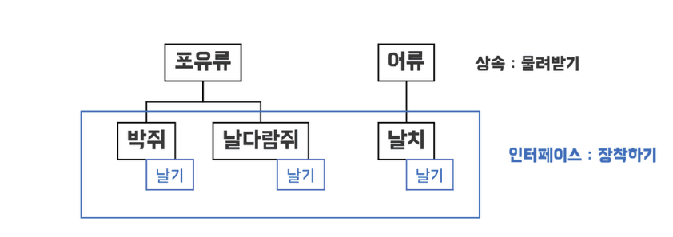

# OOP

## OOP란?

객체 지향 프로그래밍(Object-Oriented Programming, OOP)은 컴퓨터 프로그램을 명령어의 목록으로 보는 시각에서 벗어나 여러 개의 독립된 단위, 
객체 들의 상호작용으로 프로그램 로직을 구성하는 프로그래밍 패러다임이다.

💡 프로그래밍 패러다임 이란?
>프로그래머에게 프로그래밍의 관점을 갖게하고 코드를 어떻게 작성할지 결정하는 역할을 한다.

## OOP의 특징

### 1. 캡슐화(Encapsulation)💊

    한객체가 특정한 하나의 목적을 위해 필요한 데이터나 메소드를 하나로 묶는 것을 의미한다.

- 데이터는 외부에서 직접 접근을 하면 안되고 함수를 통해서만 접근해야한다.

### 2. 은닉화(Information hiding)🥷

    캡슐화의 목표. 내부구조는 private 하게 감춰두고 외붕-서 조작할 수 있는 정보만 public으로 공개한다.

### 3. 상속(Inheritance)👪

    기존 메소드와 변수를 물려받되, 필요한 기능을 더 추가하거나 나(자식클래스)에게 맞게 재정의하는 방법

상속이 👪 이런 느낌이라면, 인터페이스는 👬 이런 느낌.

- 보통 상속에서는 다중 상속은 안되거나 제한이 있는데(클래스 상속 관계에 혼란을 줄 수 있어서), 인터페이스는 이에 대해 자유롭다

- 날기 인터페이스를 implements 하는 경우, 반드시 날기 인터페이스에 있는 메소드를 정의해야 한다

- 인터페이스의 경우 implements된 모든 클래스 객체를 하나로 묶어서 한번에 명령 할 수 있다 → 짱 편함

### 4. 추상화, Abstraction ⛰️

    공통의 속성이나 기능을 묶어 이름을 붙이는 것이다

### 5. 다형성, Polymorphism 🎭

    하나의 변수명이 상황에 따라 다른 의미로 해석될 수 있다는 것을 뜻한다

### 6. 동적 바인딩 ⛓️

    runtime에 값에 따라 변수 데이터 타입, 호출될 함수가 결정된다