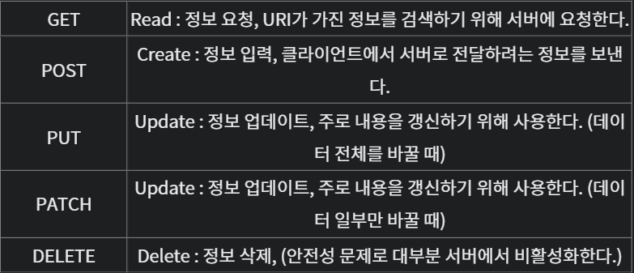

# Rest

## Rest의 정의

`Represetational State Transfer`의 약자로,  
자원을 이름 으로 구분해 해당 자원의 상태를 주고 받는 모든것을 의미합니다.
즉, 자원의 표현에 의한 상태전달이다.
- 자원:해당 소프트웨어가 관리하는 모든것 ( 문서, 그림, 데이터, 해당 소프트웨어 자체 등 )
- 표현:그 자원을 표현하기 위한 이름 ( DB의 학생 정보가 자원이면, 'students'를 자원의 표현으로 정함 )
- 상태전달:데이터가 요청되는 시점에 자원의 상태를 전달한다. ( JSON 혹은 XML을 통해 데이터를 주고 받는 것이 일반적 )

## Rest의 개념
>어떤 자원에 대한 CRUD(Create,Read,Update,Delete) 연상을 수행하기 위해 URI(Resource)로 GET,POST등의 방식을 사용하여 요청을 보내며, 요청을 위한 자원은 특정한 형태로 표련 됩니다.

## Rest의 구성요소

1. 자원(Resource)-URI
- 모든 자원에는 고유한ID가 존재하고, 이 자원은 Server에 존재한다.
- 자원을 구별하는 ID는 HTTP URI이다.
- Client는 URIㄹ르 이용해 자원을 지정하고 해당 자원의 상태(정보)에 대한 조작을 Server에 요청한다.

2. 행위(Verd)-Method
- HTTP프로토콜의 Method를 사용합니다.
- HTTP프로토콜은 GET,POST,PUT,PATCH,DELETE의 Method를 제공합니다.

3. 표현(Representation of Resource)
- Client와 Server가 데이터를 주고받는 형태로 JSON,XML,TEXT,RSS등이 있다.
- JSON,XML을 통해 데이터를 주고 받는 것이 일반적이다.