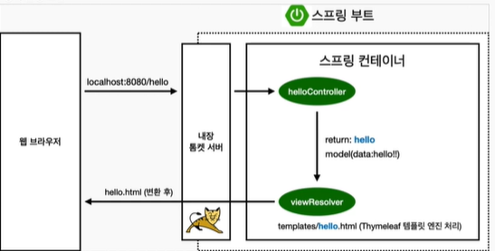

# Spring Boot

## Spring Boot란?
스프링(Spring)을 더 쉽게 이용하기 위한 도구라고 볼 수 있습니다.  

## Spring Boot의 장점
1. 라이브러리 관리 자동화.

2. 라이브러리 버전 자동관리

3. 설정 자동화

4. 내장 Tomcat

## Spring Boot의 동작 원리

### 예제



컨트롤러에서 리턴 값으론 문지를 반환하면 뷰 리졸버(`viewResolver`)가 화면을 찾아서 처리한다.

- 스프링 부트 템플릿엔진 기본 viewName 매핑
- `resouces:taplates/`+(ViewName)+`.html`

>참고:spring-boot-devtools 라이브러리를 추가하면, html 파일을 컴파일만 해주면 서버 재시작 없이 View 파일 변경이 가능하다.

코드
```java
package hello.hellospring.controller;

import org.springframework.stereotype.Controller;
import org.springframework.ui.Model;
import org.springframework.web.bind.annotation.GetMapping;

@Controller
public class HelloController {

    @GetMapping("hello")
   public String hello(Model model){
    model.addAttribute("data", "hello!!");
    return "hello";

   }
}
```

html 코드
```html
<!DOCTYPE HTML>
<html xmlns:th="http://www.thymeleaf.org">
<head>
    <title>Hello</title>
    <meta http-equiv="Content-Type" content="text/html; charset=UTF-8" />
</head>
<body>
<p th:text="'안녕하세요. ' + ${data}" >안녕하세요. 손님</p>
</body>
</html>
```