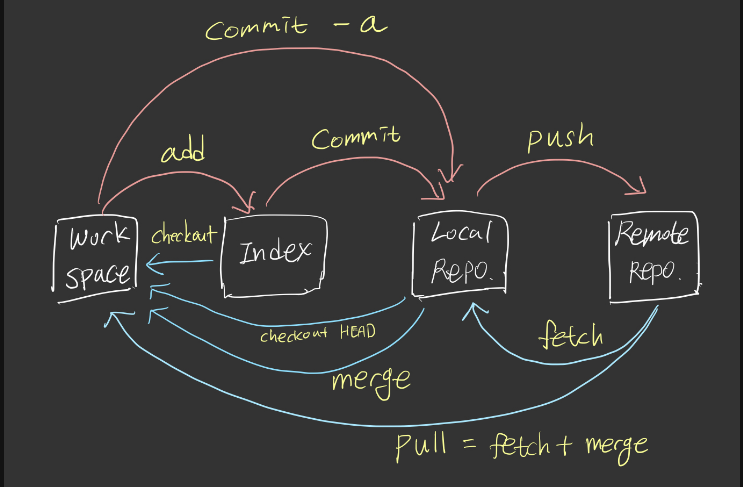

>- 깃/깃허브 구분
👉 Git : 버전 컨트롤 시스템
👉 Github : 원격 저장소
>- 현재 깃허브에서 master라는 이름 대신 main 이름을 default로 해놓은 상태지만 사용자가 master로 수정하여 사용할 수있음.

# 깃허브 시작하기
1. 깃허브 계저을 만든다.
2. 깃허브에서 repostory를 생성한다.
3. 커밋할 폴더에 들어가서 git init
4. shelldp 깃 설치 = brew install git(Mac OS)
5. 토큰이나 ssh로 인증

## 📍 깃헙 토큰 발행 방법
```
➡️github 접속 및 가입
➡️settings
➡️developer settings
➡️personal access tokens
➡️getnerate new tokens
```
✎ 토큰 설정 후 토큰 키를 복사한다음에 쉘에서 push할 때 비밀번호 작성하는 부분에 붙여넣어야 함

## 📍ssh key 설정 방법
```
shell에서
$ssh-keygen
$cat ~/.ssh/id_rsa
$cat~/.ssh/id_rsa.pub
```

✎ 이후 깃허브 프로필-세팅에서 ssh 공개키 등록


## 📍깃허브 push용 이름 및 이메일 세팅
```
$ git config --global user.name "username"
$ git config --global user.email "email@email.com"
```

✎ --global 옵션은 default로 전체 깃에 적용. 특정 프로젝트에서 이름 다르게 하려면 --global 옵션 빼고 하면 됨.

* * * 

# 깃허브 활용

## 📍기본
```
git add(파일명)         //특정 파일Index에 추가
git add .              //현재 및 하위 이렉토리 모든 파일 index추가
git commit -m "(설명)" //local repository에 추가
git push origin master //remote repository에 추가
```


## 📍 커밋 수정

로컬 저장소의 가장 마지막 커밋을 수정
```
git commit --amend -m "(설명)"
git commit --amend --no-edit  //--no--edit 옵션은 설명 수정하지 않을 때
```

## 📍 버전 확인
```
git --version
```

## 📍 커밋이력 보기
```
git log
```

## 📍원격저장소 확인
```
git remote -v
git remote add (이름) (url) //원격 저장소 추가
```

>git init 이후 github에서 리포지토리를 만든뒤 연결 세팅
git remote add origin [REPOSITORY ADDRESS]
>>REPOSITORY ADDRESS란,
https://github.com/[GITHUB USERNAME]/[REPOSITORY NAME].git
또는
git@github.com:[GITHUB USERNAME]/[REPOSITORY NAME].git

* * *

## 📍브랜치 목록 보기
```
git fetch       //정보 업데이트
git branch      //local
git branch -a   //remote까지 확인
```

## 📍파일 상태 보기
```
git status
```
index(stage) 영역에 없으면 🟥빨간색 = add 안된 상태
index(stage) 영역에 있으면 🟩초록색 = add 된 상태

# branch

## 📍 새 브랜치 만들기
```
git branch (브랜치명) 	   			   // 브랜치만 생성
$ git checkout (브랜치명)    			   // 해당 브랜치로 이동
$ git checkout -b (브랜치명) 			   // 현재 커밋에서 브랜치 생성하고 이동
$ git checkout (커밋아이디) -b (브랜치명)   //해당 커밋으로 이동 후 브랜치 생성
```

## 📍마스터 브랜치로 돌아가기
```
$ git checkout master
```

##📍 브랜치 목록 보기
```
$ git branch    //local
$ git branch -a //remote까지 확인
```

>원격브랜치는 다음 명령어로도 확인 가능
git ls-remote origin

## 📍 브랜치 삭제
```
$ git branch -d (브랜치명) 			   //로컬 저장소에서 브랜치 삭제
$ git push origin --delete (브랜치명)    //원격저장소에서도 삭제
```

## 📍 main브랜치 이름 변경
```
git branch -m main master
git fetch origin
git branch -u origin/master master
git remote set-head origin -a
```
