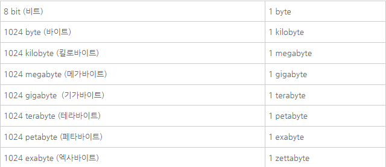
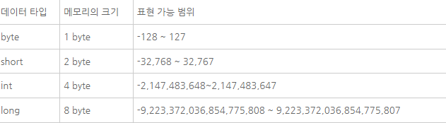
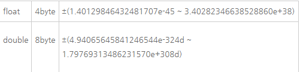

# 데이터 타입

## 데이터의 크기

위 의 표에서 볼 수 있듯이 컴퓨터에 저장되는 정보의 가장 작은 단위는 bit다. 컴퓨터를 0과 1로 이루어졌다는 말을 들어본 적이 있을 것이다. 바로 이 0과 1이 bit다. 1bit는 0이나 1의 값을 가질 수 있다. byte는 bit 보다 8배 큰 단위다. 1byte는 8비트다. 여기까지 지금 기억해야 할 내용이다. 그 외의 내용은 차차 알게 된다. 

## 정수형

## 실수형 

## 문자
