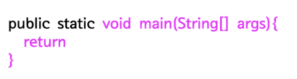
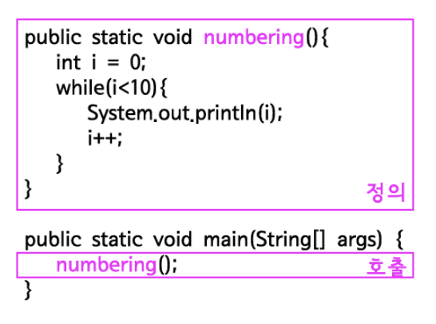
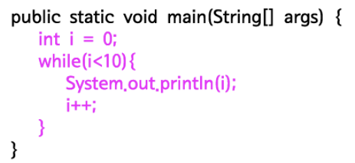

# 메소드

>메소드(method)는 코드를 재사용할 수 있게 해준다. 이번 시간에는 경제적으로 로직을 작성하는 방법에 대해서 알아볼 것이다.

## 메소드의 형식



## 메소드이 정의와 호출

직접 메소드를 만드는 것을 정의라고 하고, 만들어진 메소드를 실행하는 것을 호출이라고 한다.

예제
```java
public class MethodDemo1 {
    public static void numbering() {
        int i = 0;
        while (i < 10) {
            System.out.println(i);
            i++;
        }
    }
 
    public static void main(String[] args) {
        numbering();
    }
}
```

결과
```
0
1
2
3
4
5
6
7
8
9
```



위의 예제는 numbering이라는 이름의 메소드를 정의하고 있다. 이 메소드는 main이라는 이름의 메소드 안에서 호출되고 있다. 위의 코드는 아래의 코드와 정확하게 동일한 의미를 갖는다.



핑크색으로 표시한 부분의 코드를 numbering이라는 이름의 메소드로 묶어서 외부로 분리한 것이다. 그리고 메소드 numbering의 로직이 필요할 때 numbering();이라고하면 메소드 numbering의 로직이 실행된다.

## 입력과 출력

### 매개변수와 인자

예제
```java
public class MethodDemo4 {
    public static void numbering(int limit) {
        int i = 0;
        while (i < limit) {
            System.out.println(i);
            i++;
        }
    }
 
    public static void main(String[] args) {
        numbering(5);
    }
}
```

결과는 0부터 4까지 출력한다. 메소드를 호출할 때 괄호에 값을 주고 있는데 저 값을 다른 값으로 바꿔보자. 값에 따라서 다른 결과가 출력되고 있다. 입력을 통해서 메소드의 동작을 제어하고 있다. 아래 그림을 보자.


