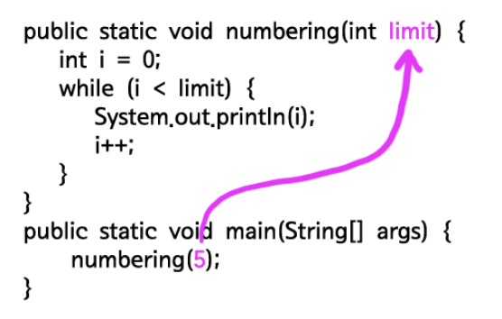

# 메소드

>메소드(method)는 코드를 재사용할 수 있게 해준다. 이번 시간에는 경제적으로 로직을 작성하는 방법에 대해서 알아볼 것이다.

## 메소드의 형식


## 메소드이 정의와 호출

직접 메소드를 만드는 것을 정의라고 하고, 만들어진 메소드를 실행하는 것을 호출이라고 한다.

예제
```java
public class MethodDemo1 {
    public static void numbering() {
        int i = 0;
        while (i < 10) {
            System.out.println(i);
            i++;
        }
    }
 
    public static void main(String[] args) {
        numbering();
    }
}
```

결과
```
0
1
2
3
4
5
6
7
8
9
```


위의 예제는 numbering이라는 이름의 메소드를 정의하고 있다. 이 메소드는 main이라는 이름의 메소드 안에서 호출되고 있다. 위의 코드는 아래의 코드와 정확하게 동일한 의미를 갖는다.


핑크색으로 표시한 부분의 코드를 numbering이라는 이름의 메소드로 묶어서 외부로 분리한 것이다. 그리고 메소드 numbering의 로직이 필요할 때 numbering();이라고하면 메소드 numbering의 로직이 실행된다.

## 입력과 출력

### 매개변수와 인자

예제
```java
public class MethodDemo4 {
    public static void numbering(int limit) {
        int i = 0;
        while (i < limit) {
            System.out.println(i);
            i++;
        }
    }
 
    public static void main(String[] args) {
        numbering(5);
    }
}
```

결과는 0부터 4까지 출력한다. 메소드를 호출할 때 괄호에 값을 주고 있는데 저 값을 다른 값으로 바꿔보자. 값에 따라서 다른 결과가 출력되고 있다. 입력을 통해서 메소드의 동작을 제어하고 있다. 아래 그림을 보자.



## 복수의 인자

만약 메소드로 여러개의 입력값을 전달하고 싶다면 어떻게 해야 할까? 다음 예제는 위의 예제를 개성해서 출력할 숫자의 시작 값과 마지막 값을 입력값으로 전달하는 예제다.

```java
public calss Test{

    public static void numbering(int init, int limit){
        int i = init;
        while(i<limit){
            System.out.priontln(i);
            i++;
        }
    }

    public static void main(String[] args){
        numbering(1,5);
    }

}
```

 결과는 1부터 4까지가 출력된다. 위와 같이 입력 값을 복수로 받고 싶다면 콤마 뒤에 매개변수를 정의해주면 된다. 또 이 메소스를 호출할 때는 매개변수의 순서대로 인자를 배치하면 된다.

## return

```java
public static String numbering(int init, int limit) {
        int i = init;
        // 만들어지는 숫자들을 output이라는 변수에 담기 위해서 변수에 빈 값을 주었다.
        String output = "";
        while (i < limit) {
            // 숫자를 화면에 출력하는 대신 변수 output에 담았다.
            output += i;
            i++;
        }
        // 중요!!! output에 담겨 있는 문자열을 메소드 외부로 반환하려면 아래와 같이 return 키워드 뒤에 반환하려는 값을
        // 배치하면 된다.
        return output;
    }
 
    public static void main(String[] args) {
        // 메소드 numbering이 리턴한 값이 변수 result에 담긴다.
        String result = numbering(1, 5);
        // 변수 result의 값을 화면에 출력한다.
        System.out.println(result);
    }
```

메소드 내에서 사용한 return은 return 뒤에 따라오는 값을 메소드의 결과로 반환한다. 동시에 메소드를 종료시킨다. 한가지 잊지 말아야 할 점은 return을 통해서 반환할 값의데이터 형식을 메소드의 이름 옆에 명시해주어야 한다는 것이다.

```java
public static Striong numbering(int init, int limit){

}
```

이것은 프로그래밍을 처음 시작하거나, JavaScript나 PHP와 같은 언어들에 익숙한 개발자에게는 까다롭고 귀찮게 느껴질 수 있는 부분이다. 하지만 메소드가 리턴 할 값을 명시함으로서 numbering이라는 메소드는 반드시 문자열의 값을 리턴한다는 것을 보장할 수 있는 장점이 있다. 모든 일에는 장점과 단점이 있다. 장단의 다면성을 충실하게 응시할 때 적합함을 얻을 수 있다. (필자도 노력중이다)

만약 반환 값이 없다면 아래와 같이 void를 적어준다.

```java
public static void numbering(int init, int limit){
    
}
```