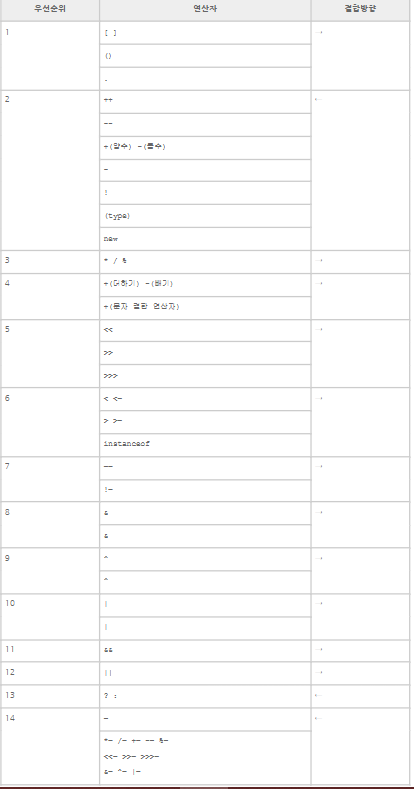

# 연산자

## 산술 연산자

>산술 연산자는 수학적인 계산에 사용되는 연산자다. 기초적인 수학적 소양이 있다면 어려운 연산자는 없다. 다만 수학에서 사용하는 연산자와 프로그래밍에서 사용하는 연산자는 기호의 모양이 조금 다르다.

|||
|:--|--:|
|+|더하기|
|-|빼기|
|*|곱하기|
|/|나누기|
|%|나머지|

예제1

```java
public class Math{
    public static void main(String[] args){
       // result 의 값은 3
        int result = 1 + 2;
        System.out.println(result);     //3
  
        // result 의 값은 2
        result = result - 1;
        System.out.println(result);     //2
  
        // result 의 값은 4
        result = result * 2;
        System.out.println(result);     //4
  
        // result 의 값은 2
        result = result / 2;
        System.out.println(result);     //2
  
        // result 의 값은 10
        result = result + 8;
        // result 의 값은 3
        result = result % 7;
        System.out.println(result);     //3
    }
}
```

예제2
```java
public class Math{
    public static void main(String[] args){
        int a=3;
        System.out.println(0%a);
        System.out.println(1%a);
        System.out.println(2%a);
        System.out.println(3%a);
        System.out.println(4%a);
        System.out.println(5%a);
        System.out.println(6%a);
    }
}
```

>+ 연산자는 숫자와숫자를 더할 때 사용되지만, 문자열과 문자열을 결합할때도 사용된다.

```java
class String{
    public static void main(String[] args){
        String first = "This is";
        String second = "a concatensted string";
        String third = "first+second";

        System.out.println(third);      //This is a concatenated string    
    }
}
```

## 단항 연산자

|||
|:--|--:|
|+|양수를 표현한다. 실제로는 사용할 필요가 없다.|
|-|음수를 표현한다.|
|++|증가 연산자로 항의 값을 1씩 증가 시킨다|
|--|감소 연산자|

```java
public class PrePostDemo {
    public static void main(String[] args) {
        int i = 3;
        i++;
        System.out.println(i); // 4 출력
        ++i;
        System.out.println(i); // 5 출력
        System.out.println(++i); // 6 출력
        System.out.println(i++); // 6 출력
        System.out.println(i); // 7 출력
    }
}
```

## 연산의 우선순위

실제로 프로그래밍하게 되면 다양한 연산자들을 복합적으로 사용하게 된다. 이럴때 연산의 선후 관계가 분명하지 않으면 혼란스러울 것이다. 아래는 자바에서 제공하는 연산자들 간의 우선순위를 정리한 표이다.


