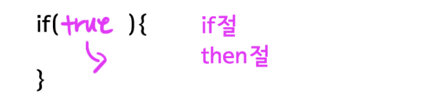
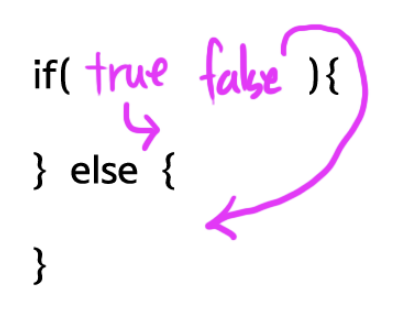
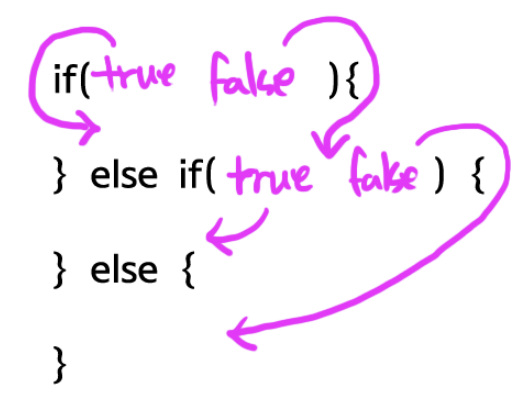

# 조건문

>조건문이란 주어진 조건에 따라서 애플리케이션을 다르게 동작하도록 하는 것으로 프로그래밍의 핵심 중의 하나라고 할 수 있다.

## if

조건문은 if로 시작한다. 아래그림을 보자. if뒤의 괄호를 if절이라고 부르고, 중괄호가 감싸고 있는 구간을 then 절이라고 부르겠다. 조건문에서는 if절의 값이 true일 때 then 절이 실행된다. if 절이 false이면then절은 실행되지 않는다.



아래 예제의 실행 결과는 `result : true`다. if 뒤에 True가 왔기 때문이다. 아래의 실행 결과는 하면에 `resutl : true`를 출려한다.

```java
public static void main(String[] args) {
        if(true){
            System.out.println("result : true");
        }
    }
```

다음 예제는 아무것도 출려하지 않을 것이다.if절이 false이기 때문이다.

```java
if(false){
    System.out.println("result : true");
}
```

다음 예제를 보자. 결과는 12345를 출력할 것이다.

```java
 public static void main(String[] args) {
        if (true) {
            System.out.println(1);
            System.out.println(2);
            System.out.println(3);
            System.out.println(4);
        }
        System.out.println(5);
    }
```

다음 예제를 실행해보자. 결과는 5만 출려될것이다.

```java
if(false){
    System.out.println(1);
    System.out.println(2);
    System.out.println(3);
    System.out.println(4);
}
System.out.println(5);
```

## else

>if만으로는 좀 더 복자한 상황을  처리하는데 부족하다. 아래의 그림처럼 if-else절을 if절의 값이 true일때then절이 실행되고, false일때 else절이 실행된다.



아래 예제를 보자 결관는 1이다.

```java
public static void main(String[] args) {
        if (true) {
            System.out.println(1);
        } else {
            System.out.println(2);
        }
 
    }
```

다음예제의 결과는 2이다.

```java
if(false){
    System.out.println(1);
} else {
    System.out.println(2);
}
```

## else if

>else if절을 이용하면 조건문의 흐름을 좀 더 자유롭게 제어할 수 있다. if절의 값이 true라면 then절이 실행된다. false라면 else if절로 제어가 넘어간다. else if절의 값이 true라면 else if then절이 실행된다. false라면 else 절이 실행된다. else if절은 여러 개가 복수로 등장할 수 있고, else절은 생략이 가능하다. else 절이 else if 절보다 먼저 등장할 수는 없다.



아래 예제를 보자. 결과는 2다.

```java
public static void main(String[] args) {
        if (false) {
            System.out.println(1);
        } else if (true) {
            System.out.println(2);
        } else if (true) {
            System.out.println(3);
        } else {
            System.out.println(4);
        }
 
    }
```

다음 예제의 결과는 3이다.

```java
if(false){
    System.out.println(1);
} else if(false) {
    System.out.println(2);
} else if(false) {
    System.out.println(3);
} else {
    System.out.println(4);
}
```