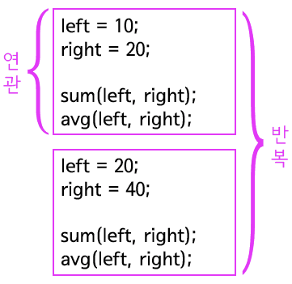

# 클래스와 인스턴스 그리고 객체

## 객체화

>객체 지향은 많은 선배 프로그래머들에 의해서 만들어졌기 때문에 다양한 의도가 반영된 프로그래밍 패러다임이다. 그래서 객체 지향이 만들어진 동기를 하나의 케이스로 설명하는 것은 어려운 일이다.

객체 지향의 핵심은 연관되어 있는 변수와 메소드를 하나의 그룹으로 묶어서 그룹핑하는 것이다. 위의 예제를 분석해보자. 연관되어 있는 부분과 반복적인 부분을 찾아 볼 수 있다.



메소드 sum과 avg는 변수 left와 right와 서로 연관 되어 있다. 또한 합계와 평균을 구하는 작업은 다른 에플리케이션에서도 사용할 수 있는 기능이다. 이것들을 그룹핑해서 하나의 부품으로 만들면 필요할 때마다 반복적으로 사용할 수 있을 것이다. 객체를 만들 때가 된 것이다.

아래의 예제는 의미적으로 연관된 로직들을 물리적으로 응집된 하나의 객체로 만드는 법을 설명하는 예제다.

```java
class Class2{
    int left, right;

    public void setOprands(int left, int right){
        this.left=left;
        this.right=right;
    }

    public void sum(){
        System.out.println(this.left+this.right);
    }

     public void avg(){
        System.out.println((this.left+this.right)/2);
    }

}

public class Class1{

    public static void main(String[] args){
        Class2 c1 = new Class2();
        c2.setOprands(10,20);
        c2.sum();
        c2.avg();

        Class2 c2 = new Class2();
        c2.setOprands(20, 40);
        c2.sum();       
        c2.avg();


    }
}
```


## 클래스

```java
class Class2
```

위의 예에서 변수 left와 right, 메소드 sum과 avg는 연관되어 있는 로직이다. 이 로직들의 연관성은 계산을 하기 위한 것이다. 그래서 필자는 이 로직들을 대표하는 이름을 계산기라는 의미의 Calculator라고 정하고 이것들을 Calculator이라는 이름으로 그룹핑하고 싶다. 이럴 때 사용하는 키워드가 class이다. class 키워드 뒤에는 클래스 이름이 오고 그 뒤의 중괄호는 클래스의 시작과 끝의 경계를 의미한다. 이렇게 해서 더하기(sum)와 평균(avg)를 계산 할 수 있는 클래스가 만들어졌다. 클래스는 아래와 같이 정의 할 수 있다

>`클래스는 연관되어 있는 변수와 메소드의 집합이다.`

## 인스턴스

이제 클래스를 사용하는 방법을 알아보자. 클래스는 일종의 설계도다. 클래스를 정의하는 것 자체로는 할 수 있는 일이 많지 않다. 설계도를 구체적인 제품으로 만들어야 한다. 그 때 사용하는 키워드가 new이다. 25번 라인을 보자.

```java
Class2 c1 = new Class2();
```
new Class2()은 클래스 Class2를 구체적인 제품으로 만드는 명령이다. 이렇게 만들어진 구체적인 제품을 인스턴스(instance)라고 부른다. 아래의 관계를 기억하자.

- 클래스: 설계도
- 인스턴스: 제품

|데이터 타입|변수명|
|:--|--:|
|int|a;|
|String|a;|
|float|a;|
|long|a;|
|char|a;

