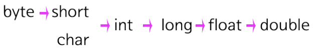

# 형변환

## 자동 형 변환

```java
double a=3.0F;
```
위의 코드의 double 타입의 변수 a에 float타입의 값을 대입하고 있다. 이 때 3.0F의 값은 자동으로 double 타입으로 형 변환이 일어난다. 이것이 가능한 이유는 double 타입이 float 타입보다 더 많은 수를 표현 할 수 있기 때문이다. 타입을 변경해도 정보의 손실이 일어나지 않는 경우 자동 형 변환이 일어난다.

반대로 아래의 예제는 오류가 발생한다. 상수 3.0은 상수인데, 이 상수는 double 형이다. 이 값을 표현 범위가 좁은 float에 넣으려고 하기 때문에 오류가 발생한다.

```java
float a=3.0;
```

>자동 형 변환의 원칙은 표현범위가 좁은 데이터 타입에서 넓은 데이터 타입으로의 변환만 허용된다는 것이다.

아래는 자동 형 변환이 일어나는 규칙을 보여준다.



```java
int a=3;
float b=1.0F;
double c=a+b;
```

위의 연산은 두 번의 형 변환이 일어난다. 우선 a와 b를 더하기 위해서 정수 a와 실수 b 중 하나가 형 변환을 해야 한다. 위의 그림에 따르면 int와 float가 붙으면 int가 float가 되기 때문에 변수 a에 담겨있는 값 3은 float 타입이 된다. 연산 결과는 float 타입이다. 하지만 이 값이 담겨질 변수 C의 타입은 double이다. float가 double 타입의 변수에 담기기 위해서는 float가 double로 형 변환을 해야 한다. 이렇게 해서 최종적으로 형 변환된 값이 변수 c에 담겼다.

## 명시적 형 변환

자동 형 변한이 적용되지 않는 경우에는 수동으로 형 변환을 해야 한다. 이를 명시적이라고 한다. 아래 예제는 모든 행의 코드에서 오류가 발생한다. 자동 형 변환이 이루어지지 않기 때문이다.

```java
float a=100.0;
int b=100.0F;
```

위의 예제를 조금 수정해 보자. 아래 코드는 오류가 발생하지 않는다.

```java
float a=(float)100.0;
int b=(int)100.0F;
```

아래와 같이 괄호 안에 데이터 타입을 지정해서 값 앞에 위치시키는 것을 명시적인 형 변환이라고 부른다.