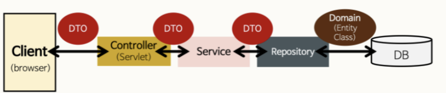
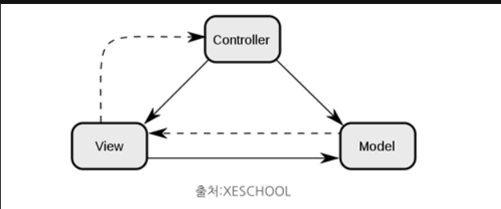

## MVC 패턴

먼저!! 
>Controller가 무엇인지 알기 전에 MVC 패턴에 대하여 먼저 아는 것이 중요하다.



### MVC 패턴이란?
- MVC패턴은 Model-View-Controller의 약자로서 개발을 할 때 3가지 형태로 역할을 나누어 개발하는 방법론이다



- Model

    + 어플리케이션이 무엇을 할 것인지 정의하는 부분입니다. 즉 DB와 연동하여 사용자가 입력한 데이터나 사용자에게 출려할 데이터를 다룹니다.

- View

    + 사용자에게 시각적으로 보여주는 부분(UI)

- Controller

    + Model이 데이터를 어떨게 처리할지 알려주는 역할을 한다,사용자에 의해 클라이언트가 보낸 데이터가 있으면 모델을 호출하기 전에 적절히 가공을 하고 모델을 호출한다.

# Controller

## Controller란?

Controller은 MVC에서 C에 해당 하며 주로 사용자의 요청을 처리 한 후 지정된 뷰에 모델 객체를 넘겨주는 역할을 합니다.

## Controller 사용이유

>예를 들어 대규모 서비스중 A서비스,B서비스,C서비스가 있다면 많은서비스를 한 클래스에 만들어서 꽉꽉 몰아 처리하는것이아니라  
>Controller라는 중간 제어자를 만들어서 개발비용이나 유지보수 비용을 대폭 줄이기 위함이다.

## Controller 사용법

1. @Controller(Spring MVC Controller)

@Controller는 주로 View를 반환하기 위해 사용한다.
하지만 @ResponseBody 어노테이션과 같이 사용하면 RestContoller와 똑같은 기능을 수행할 수 있습니다.

예시
```java
@Controller
public class Controllerprac {
    @GetMapping("/home") //home으로 Get요청이들어오면
    public String homepage(){
        return "home.html"; //home.html생성
    }
}
```
2. @RestController(Spring Restful Controller)Permalink

RestController는 Controller에서 @ResponseBody 어노테이션이 붙은 효과를 지니게 됩니다.
즉 주용도는 JSON/XML형태로 객체 데이터 반환을 목적으로 합니다.

예시
```java
@RestController // JSON으로 데이터를 주고받음을 선언합니다.
public class ProductRestController {

    private final ProductService productService;
    private final ProductRepository productRepository;

    // 등록된 전체 상품 목록 조회
    @GetMapping("/api/products")
    public List<Product> getProducts() {
        return productRepository.findAll();
    }
}
```