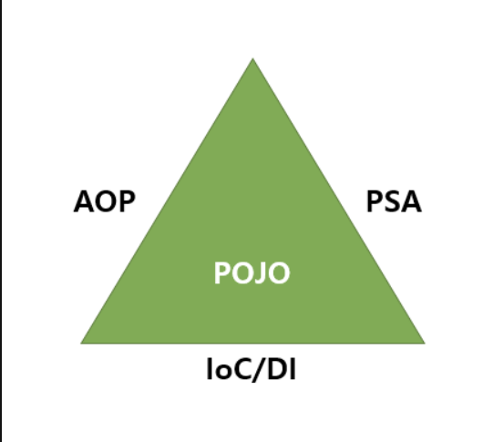

# Spring FrameWork

## 프레임워크란 무엇일까?

자바 플랫폼을 위한 오픈 소스 애플리케이션 프레임워크로서 간단히 스프링 이라고도 한다.
동적인 웹 사이트를 개발하기 위한 여러 가지 서비스를 제공하고 있다.

## 스프링 프레임워크의 특징


스프링은 POJO를 기반으로 AOP,PSA,IoC/DI 특징을 가진다.

POJO
- 순수한 오래된 자바 객체
- 프레임워크 업이도 돌아가는 순수한 자바 객체
- 특정 기숭에 종속 되지 않는 순수한 자바 객체

AOP(Aspect Oriented Programming) 관점 지향 프로그래밍
=관심사의 분리

첫번째 관점:공통되는 부분
두번째 관점:핵심이 되는 부분

- 공통관심 사항 cross-cutting concern
    + 중복되는 공통 코드

- 핵심 관심사항 core concern
    + 비지니스 로직

IoC 제어의 역전/역행

이전에는 코드 관리(Control)는 개발자의 일이었다. 객체의 생성부터 소멸까지의 라이프사이클 제어권은 개발자가 갖고있었다.

그런데 개발자가 프레임워크 API를 사용하게 되면서, 설정파일을 통해서 객체의 라이프사이클, 클래스 등을 프레임워크가 직접 제어하게 되었다.

>즉, 개발자가 직접 제어하는 부분을 프레임워크가 대신 제어하게 되어 제어권을 가지게 되었다는 말이다. -> 그래서 제어의 역전이라고 한다.
>>DI (Dependency Injection) 의존성 주입/ 종속성 주입

>의존 : A 클래스에서 B 클래스에 있는 기능을 사용하는 것(B 클래스 = 의존하는 객체)

의존하는 객체를 직접 생성(new)하지 않고, 스프링 컨테이너에서 의존하는 객체를 전달(주입) 받는 것.
쉽게 생각하면 객체 생성할 때 new 안쓰는 것

>스프링 컨테이너 : 객체의 라이프사이클(생성부터 소멸까지)을 관리하는 역할(= IoC컨테이너, BeanFactory)

- 스프링 컨테이너가 관리하는 객체 : 빈(Bean)
- Bean을 관리한다고 해서 BeanFactory라고도 함.
- BeanFactory에 기능들을 추가한 것 중 애플리케이션컨텍스트(applicationContext)가 있다.

### DI를 적용하지 않았을 때
이런 HomeService, HomeController 클래스가 있다고 치자.
HomeController에서 HomeService클래스 안의 메소드를 사용하고 싶다.
그래서 HomService객체를 생성했고, 인스턴스를 얻기 위해 new를 사용했다.
***

```java
/*
 * HomService.java
*/
@Service
public class HomeService {
	public String sayHello() {
		return "굿모닝~!";
	}
}

/*
 * HomeController.java
*/
@Controller
public class HomeController {

	@RequestMapping(value="/index.do")
	public String MVCController(Model model) {
    
		HomeService homeService; //객체 선언 - 아직 어떠한 메모리도 차지하지 않음
        homeService = new HomeService(); //객체의 인스턴스를 얻음 - 메모리 할당됨
 		model.addAttribute("homeService",homeService.sayHello());	
		return "index";
	}
}
```

그래서 스프링은 이런 기능을 내놓았다.

### DI를 적용했을 때
객체의 인스턴스를 얻기 위해 new를 사용하지 않고 @Autowired 어노테이션을 사용했다.

@Autowired : 스프링 컨테이너가 관리하는 Bean들 중에 @Autowired로 선언한 객체와 동일한 Bean이 있으면 의존관계를 주입해줌.
해당 객체가 Bean으로 등록되지 않았다면 주입 불가
*** 

```java
/*
 * HomService.java
*/
@Service
public class HomeService {
	public String sayHello() {
		return "굿모닝~!";
	}
}

/*
 * HomeController.java
*/
@Controller
public class HomeController {

	@RequestMapping(value="/index.do")
	public String MVCController(Model model) {
    	
        @Autowired //어노테이션 추가 - 인스턴스 얻음
		HomeService homeService; //객체 선언 - 아직 어떠한 메모리도 차지하지 않음
 		model.addAttribute("homeService",homeService.sayHello());	
		return "index";
	}
}
```

PSA (Portable Service Abstraction) 일관성 있는 추상화

스프링 라이브러리는 POJO를 쓰기 위해서 PSA 형태로 추상화 되어있다.
POJO를 사용하면서 다른 기능을 쓰기 위해서 중간 역할을 해주는 것이 필요하다. 그것은 바로

- 어노테이션 (annotation)
    + 서블릿 기반으로 동작
    + 추상화 계층에 숨겨져있음
    + 어노테이션만 선언하면 내부적으로 다 동작이 되도록 추상화되어있음.
    + doGet(), doPost()나 extends, implements 등등을 없애고 대신 어노테이션을 사용.