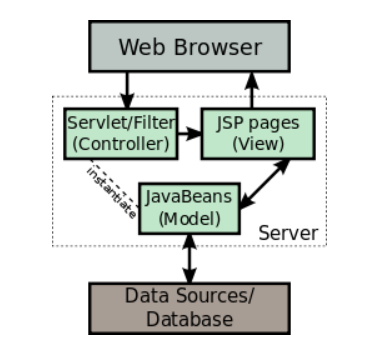
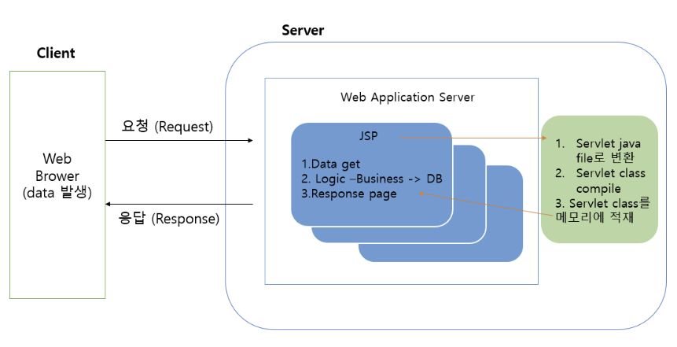

# JSP

## JSP란?

>JSP는 HTML내에 자바 코드를 삽입하여 웹 서버에서 동적으로 웹 페이지를 생성하여 웹 브라우저에게 돌려주는 언어이다. Java EE 스펙 중 일부로 WAS에서 동작한다

- Servlet이 Java소스안에 HTML을 작성하면, JSP는 HTML에 Java코드를 삽입한다.
- 정적인 HTML에 동적으로 사용자가 입력한 content를 혼합하여 동적인 웹페이지를 생성한다.

## JSP의 특징

1. 스크립트 언어이기 때문에 자바 기능을 그대로 사용할 수 있다.

2. Tomcat(WAS)이 만들어 놓은 객체를 사용한다.

3. 사용자 정의 태그를 사용하여 효율적인 웹사이트를 구성할 수 있다.

## JSP의 동작 흐름

>최초 jsp 요청하면 jsp file로 변경될때 jsp가 servlet으로 변경됨