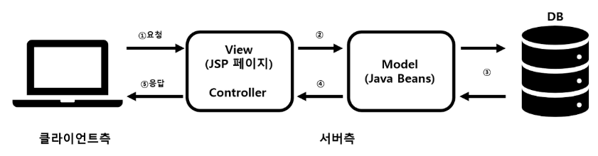
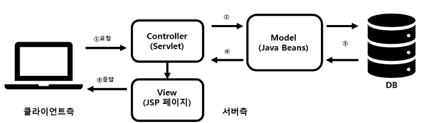

# MVC패턴

## 💡 MVC 패턴이란?

아래 그림처럼 사용자가 COntroller를 조작하면 Controller는 Model을 통해 데이터를 가져오고 그 데이터를 바탕으로 View를 통해 시각적 표현을 제어하여 사용자에게 전달하게 된다.

### ✔️ 위의 개념을 WEB에 적용 시!

1. 사용자가 웹사이트에 접속
2. 사용자가 Controller를 사용하여 요청한 웹페이지를 서비스하기 위해서 모델을 호출
3. Model은 데이터베이스나 파일과 같은 데이터 소스를 제어한 후 그 결과를 Return
4. Controller는 Model이 리턴한 결과를 View에 반영 (Updates)
5. 데이터가 반영된 View는 사용자에게 보여짐 (Sees)
 
## 🌈MVC패턴 방식 

MVC패턴에는 방식 1,2가 있다.
- 방식 1: JSP에서 출려과 로직을 전부 처리
- 방식 2: JSP에서 출려만 처리

### 📌 Model 1

>모델 1 방식은 Controller 영역에 View 영역을 같이 구현하는 방식이며, 사용자의 요청을 JSP가 전부 처리합니다. 요청을 받은 JSP는 JavaBean Service Class를 사용하여 웹브라우저 사용자가 요청한 작업을 처리하고 그 결과를 출력합니다.

### 📌 Model 2

>모델 2 방식은 웹브라우저 사용자의 요청을 서블릿이 받고 서블릿은 해당 요청으로 View로 보여줄 것인지 Model로 보낼 것인지를 판단하여 전송합니다. 또한 모델 2 방식의 경우 HTML 소스와 JAVA소스를 분리해놓았기 때문에 모델 1 방식에 비해 확장시키기도 쉽고 유지보수 또한 쉽습니다.

👀 Model 1 vs Model 2

|    |방식 1|방식 2|
|:--|:--:|--:|
|장점|빠르고 쉽게 개발 가능|디자이너와 개발자의 분업이 가능하며 유지보수 및 확장이 쉬움
|단접|JSP파일이 너무 비대해지며 Controller와View가 혼재하므로 향후 유지보수에 어려움|설계가 어려우며 개발 난이도가 높음|

## 📲 모델 (Model)
데이터를 가진 객체를 모델이라고 지칭합니다. 데이터는 내부의 상태에 대한 정보를 가질 수도 있고, 모델을 표현하는 이름 속성으로 가질 수 있다. 
모델의 상태에 변화가 있을 때 컨트롤러와 뷰에 이를 통보합니다. 이와 같은 통보를 통해 뷰는 최신의 결과를 보여줄 수 있고, 컨트롤러는 모델의 변화에 따른 적용 가능한 명령을 추가, 제거, 수정할 수 있습니다.

모델의 규칙

- 사용자가 편집하길 원하는 모든 데이터를 가지고 있어야만 함
- 뷰나 컨트롤러에 대해서 어떠한 정보도 알지 말아야 함
- 변경이 일어나면, 변경 통지에 대한 처리방법을 구현해야 함
 

## 🖥️ 뷰 (View)
View는 클라이언트 측 기술은 HTML/CSS/Javascript들을 모와둔 컨테이너입니다. 사용자가 볼 결과물을 생성하기 위해 모델로부터 정보를 얻어옵니다.

뷰의 규칙

- 모델이 가지고 있는 정보를 따로 저장해서는 안됨
- 모델이나 컨트롤러와 같이 다른 구성 요소를 몰라야 함
- 변경이 일어나면, 변경 통지에 대한 처리방법을 구현해야 함
 

## 🕹️ 컨트롤러 (Controller)
사용자가 접근한 URL에 따라 사용자의 요청사항을 파악한 후에 그 요청에 맞는 데이터를 Model을 의뢰하고, 데이터를 View에 반영해서 사용자에게 알려줍니다.

모델에 명령을 보냄으로써 뷰의 상태를 변경할 수 있음 => (워드에서 문서 편집)
컨트롤러가 관련된 모델에 명령을 보냄으로써 뷰의 표시 방법을 바꿀 수 있음 => (문서를 스크롤하는 것)

컨트롤러의 규칙

- 모델이냐 뷰에 대해서 알고 있어야 함
- 모델이나 뷰의 변경을 모니터링해야 함