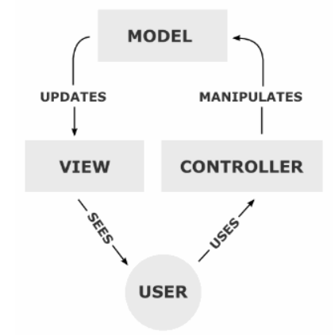

# MVC

## MVC란?

MVC란 Model-View-Controller의 략자로 애플리케이션을 세 가지 역할로 구분한 개발 방법론 이다.
위의 그림처럼 사용자가 Controller를 조작하면 Controller는 Model을 통해 데이터를 가져오고 그 데이터를 바탕으로 View를 통해 사각적 표현 을 제어하여 사용자에게 전달하게 됩니다.

출처: https://github.com/uuuuuuuk

1. Model(모델)
 
어플리케이션의 데이터이며, 모든 데이터 정보를 가공하여 가지고 있는 컴포넌트이다.

- 사용자가 이용하려는 모든 데이터를 가지고 있어야하는, View 또는 Controller에 대해 어떠한 정보도 알 수 없어야 한다.

2. View(뷰)

시각적인 UI요소를 지칭하는 용어이다.

- Model이 가지고 있는 데이터를 저장하면 안된다.

3. Contoller

Model과 View를 연결해주는 역할을 한다.

