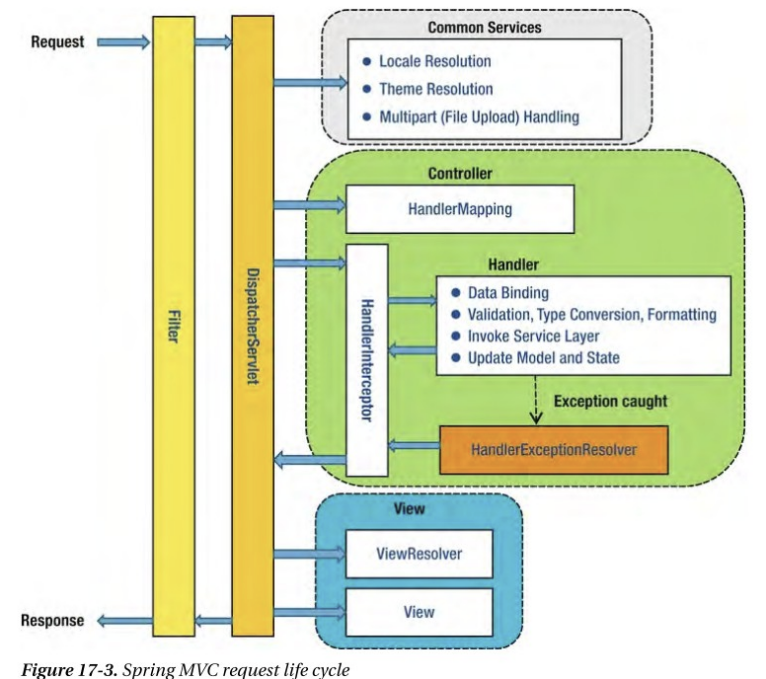

# Spring Security


## Spring Security란?
- Spring Security는 Spring기반 애플리케이션의 보안을 담당하는 스프링 하위 프레임워크이다.
- Spring Security는 `인증(Authentication)`과`권한(Authorization)`에 대한 부분을 Filter의 흐름에 따라 처리를 하고 있다.
- 많은 보안 관련 옵션들을 제공해주어 개발자가 보안 로직을 하나씩 작성하지 않아도 되는 장점이 있다.

### 인증(Authentication)과 권한(Authorization)

- 인증(Authentication)
    + 사이트에 접속하려는 자가 누구인지 확인하는 절차이다. (사용자가 본인인지 확인)
    + 사이트에 접속하려는 자가 누구인지 확인하는 절차이다. (사용자가 본인인지 확인)

- 인가,권한(Authorization)
    + 사용자가 어떤 일을 할 수 있는지 권한 설정하는 절차이다.
    + 특정 페이지/리소스에 접근 할 수 있는지 권한을 판단한다.

>인증(Authentication)절차를 거친 후에 권한(Authorization)절차를 진행하게 된다.

>Spring Security에서는 이러한 인증과 인가를 위해 Principal을 아이디로, Credential을 비밀번호로 사용하는 Credential 기반의 인증 방식을 사용한다.

## Spring Security 의존성 추가 방법

Maven 방식
```java
        <dependency>
            <groupId>org.springframework.boot</groupId>
            <artifactId>spring-boot-starter-security</artifactId>
        </dependency>
```

Gradle 방식
```java
implementation 'org.springframework.boot:spring-boot-starter-security'
implementation 'org.thymeleaf.extras:thymeleaf-extras-springsecurity5'
```

## Spring Security의 동작원리



위의 life cycle 구조를 보면, request를 낚아채서 검증하는 부분은 두 군데 있다는 것을 알수있다.
- Filter
- Interceptor
그런데 interceptor에서 request를 낚아채기에는, 문제가 하나 있다. 경우네따라서는 Web resource에 대한 접근도 제한해야할 수도 있기 떄문이다.
따라서, 저희는 위의 논리에 따라서 Spring Security는 Filter단계에서 작동한다라고 추측할수있다.
그런데 실제로도 Spring Security는 Fiter단계에서 동작한다. 