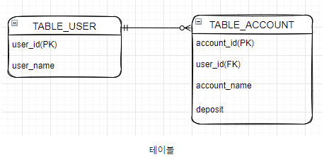
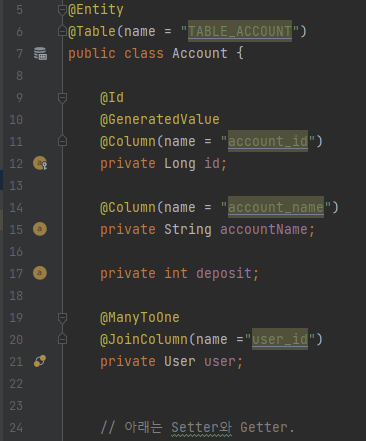
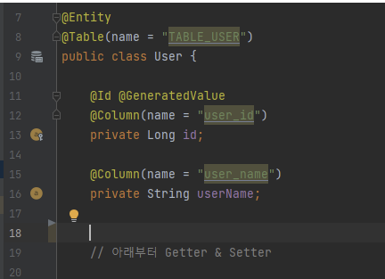
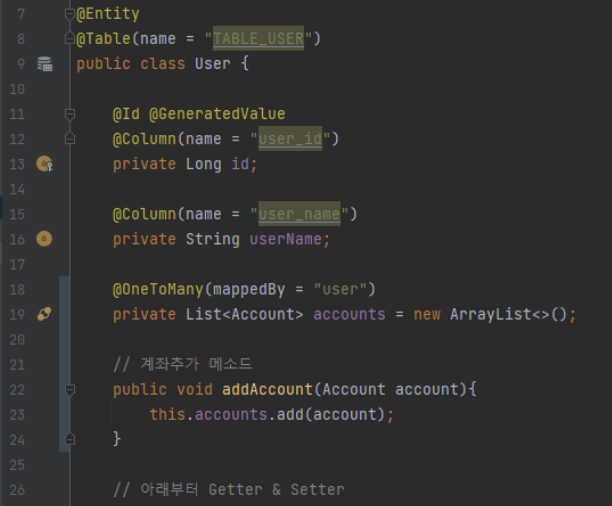

# Table_relationship

## 테이블 구조

예) 은행 서비스에서 사용자가 1개 이상의 계좌를 가질수 있다면 아래처러 룰리 테이블을 설계할것이다. TABLE_USER입장에서 보면 OneToMany이고, TABLE_ACCOUNT입장에서 보면 ManyToONe이다.

## ManyToOne 단방향

TABLE_ACCOUNT 테이블에 존재하는 user_id컬럼을 통해 ACCOUNT Entity에 있는 user필드의 정보를 채운 다.
여러개의 계좌가 사용자 한명에게 사용될수 있으므로 @ManyToOne어노테이션을 추가한다.
연관관계의 주인임을 나타내고 물리 테이블에 있는 user_id컬럼을 통해 user필드를 채우기 위해 @Join Column을 작성한다.

User Entity에서는 별다른 코드를 작성하지 않는다.

## ManyToOne 양방향

Account Entity의 user 필드가 관계의 주인이고, User Entity에서 Account Entity 정보를 조회할 수 있도록 하는 양방향 매핑 코드를 작성한다.

 

양방향 매핑을 위해서 User Entity에 코드를 추가하면 된다. 

- User Entity는 다수의 Account Entity를 가질수 있기 때문에 List<Account> 형으로 객체를 정의한다.

- 사용자 한명의 여러개의 계좌를 가질수 있으므로 @OneToMany 어노테이션을 추가한다. 

- 조회하려는 정보는 Account Entity의 user 정보를 참고할것이기 때문에 mappedBy를 통해 연관관계를 매핑한다. ( 생략하면 실행시 중간 테이블 생성됨!! )

- 계좌 추가의 편의를 위한 addAccount 메소드를 추가한다. Line 22~24 참고

