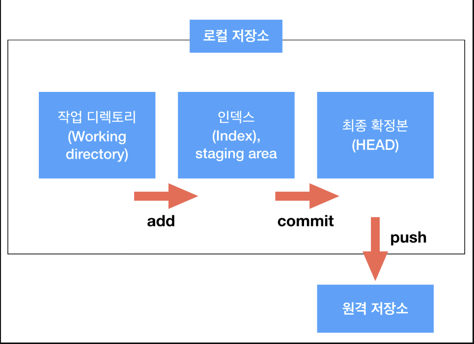

# 깃허브(github) 명령어
## git init
`git init`의 init은 initialize(초기화)를 뜻한다.
```
->github_test git init
Initialized empty Git repository in /Users/LeeJongMin/github_test/.git/
```

>깃허브의 저장소 구조를 간단히 살펴보면, 크게 로컬 저장소와 원격 저장소로 나뉩니다. 각 단계에 맞춰 코드를 등록하고 저장합니다.



## git status

>지정된 저장소의 현재 상태를 나타내며, 상태 변경이 필요한 파일들을 알려주기도 합니다.
```
->github_test git:(master) ✗ git status
On branch master

No commits yet

Untracked files:
  (use "git add <file>..." to include in what will be committed)
	Readme.txt

nothing added to commit but untracked files present (use "git add" to track)
```

## git add <파일 이름>

`git add` 뒤에 스테이지에 올릴 파일 이름을 적어 작업을 진행합니다. 참고로 `git add --all`이나 `git add .`을 사용하면 status에 나온 변경사항을 모두 스테이지에 올려줍니다.

```
->github_test git:(master) ✗ git add Readme.txt
->github_test git:(master) ✗ git status
On branch master

No commits yet

Changes to be committed:
  (use "git rm --cached <file>..." to unstage)
	new file:   Readme.txt

->github_test git:(master) ✗ 
```

## git commit -m "커밋 내용"
로컬 저장소의 최종 단계인 Head에 파일을 등록하기 위해서는 `git commit`을 사용해야한다. 현재 커밋 대상이 되어있는 파일을 한 번에 모두 커밋시키며, -m 뒤에는 버전 관리를 위한 커밋 메시지를 작성해야합니다.

```
-> github_test git:(master) ✗ git commit -m "첫번째 커밋"
[master (root-commit) 74351d0] 첫번째 커밋
 1 file changed, 0 insertions(+), 0 deletions(-)
 create mode 100644 Readme.txt
->  github_test git:(master) git status
On branch master
nothing to commit, working tree clean
```

## git remote add origin
`git remote add` 는 현재의 로컬 저장소를 깃허브에 있는 특정 레퍼지토리에 연결하겠다는 명령어 입니다.
```
git remote add origin https://github.com/jomminii/text001.git
->  github_test git:(master) git remote -v
origin	https://github.com/jomminii/text001.git (fetch)
origin	https://github.com/jomminii/text001.git (push)
```

## git push <리모트 저장소 이름> <push할 브랜치 이름>
>`git push` 명령어를 사용하면, 드디어 로컬 저장소에 있던 파일을 원격 저장소로 보낼 수 있게 됩니다.
```
->  github_test git:(master) git push origin master
Enumerating objects: 3, done.
Counting objects: 100% (3/3), done.
Writing objects: 100% (3/3), 227 bytes | 113.00 KiB/s, done.
Total 3 (delta 0), reused 0 (delta 0)
To https://github.com/jomminii/text001.git
 * [new branch]      master -> master
 ```

 -끝-