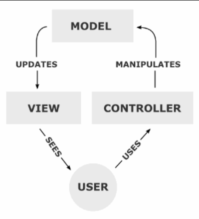
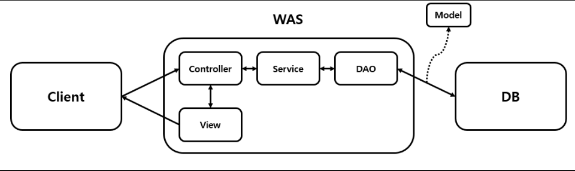

# Spring

## spring 이란?
- JAVA의 웹 프레임워크로 JAVA 언어를 기반으로 사용한다. JAVA로 다양한 어플리케이션을 만들기 위한 프로그래밍 틀이라 할 수 있다.

- 프로젝트를 진행하다 보면 아무리 분업을 해도 분명 중복되는 코드가 있기 마련이다. Spring은 이런 <u>**중복코드의 사용률을 줄여주고, 비즈니스 로직을 더 간단**</u>하게 해줄 수 있다.

- Spring을 사용하면 다른 사람의 코드를 참조하여 쓰기 편리한데 이말의 의미는 <u>**오픈소스를 좀더 효율적으로 가져다 쓰기 좋은 구조**</u>라는 것이다.

- 결론적으로 <mark>Spring이란 JAVA 기술들을 더 쉽게 사용할 수 있게 해주는 오픈소스 프레임 워크</mark>이다.

# Spring의 특징
## 1. 경량 컨테이너로 자바 객체를 담고 직접 관리한다.

- 객체의 생성 및 소멸과 같은 생명 주기(Life cycle)을 관리하며, Spring Container에서 필요한 객체를 가져와 사용한다.

## 2. 제어의 역전 (IOC, Inversion Of Control)

- 객체의 생성부터 소멸까지 객체 생명주기 관리를 사용자가 아닌 특별한 객체에게 맡기는 것

> Spring의 IOC란

클래스 내부의 객체 생성 -> 의존성 객체의 메소드 호출이 아닌,

    Spring에게 제어를 위임하여 스프링이 만든 객체를 주입 -> 의존성 객체의 메소드 호출 구조

이다.

## 3. 의존성 주입 (DI, Dependency Injection)

- 어떤 객체(B)를 사용하는 주체(A)가 객체(B)를 <u>직접 생성</u>하는 것이 아니라,
객체를 <u>외부(Spring)</u>에서 생성해서 사용하려는 주체 객체(A)에 주입시키는 방식

>IOC에서의 DI란

각 클래스 사이에 필요한 의존관계를 

    Bean 설정 정보를 바탕으로 container가 자동으로 

연결해 주는 것

### 장점
1) 클라이언트 코드를 변경하지 않고, 클라이언트가 호출하는 대상의 타입 인스턴스를 변경할 수 있다.
2) 정적인 클래스 의존관계를 변경하지 않고, 동적인 객체 인스턴스 의존관계를 쉽게 변경할 수 있다.

## 4. Model-View-Controller 패턴

- MVC는 사용자 인터페이스, 데이터 및 논리 제어를 구현하는데 널리 사용되는 소프트웨어 디자인 패턴이다.

> 처리순서

1. 사용자의 Request를 Controller가 받는다.  
2. Controller는 Business Logic을 Service와 같이 처리한 후 결과를 Model에 담는다.  
3. Model에 저장된 결과를 바탕으로 시각처리를 담당하는 View를 제어하여 사용자에게 전달한다.

**Controller**  
사용자가 접근한 URL에 따라 요청을 파악한다.  
URL에 맞는 Method를 호출하여 Service와 함께 Business Logic을 처리한다.  
최종적으로 나온 결과는 Model에 저장하고, View에 던져준다.  

**Model**  
Controller에서 받은 데이터를 저장하는 역할을 한다.  

**View**  
Controller로부터 받은 Model 데이터를 바탕으로 사용자에게 표현해준다.  

## - 구조

Controller는 RequestMapping을 통해 URL을 확인하여 바로 View에 던져줄지, Service로 들어가 추가적인 Business Logic을 거칠지 결정한다.  
HTML과 Java를 분리하여 처리하기에 확정성과 유지보수성이 높다.  

# Spring 학습을 위한 사전지식

1. HTML, CSS, JS
웹 문서를 구성하는 언어 HTML, CSS, JS에 대한 기본적인 이해가 있어야한다.

2. Servlet, JSP
웹 페이지를 동적으로 생성하는 서버측 프로그램에 대한 내용이다. 동적인 웹 어플리케이션 개발을 위한 기본이다.

3. 데이터베이스
서버측에서 데이터베이스를 다루기 때문에 데이터베이스에 대한 기본적인 지식이 필요하다.