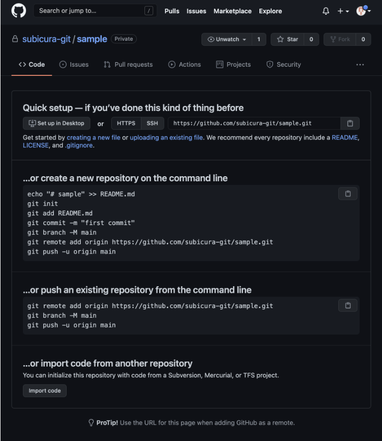

# GitHub

## GitHub란?
- 분산 버전 컨트롤 소프트웨어 깃Git을 기반으로 소스 코드를 호스팅 하고, 협업 지원 기능들을 지원하는 마이크로소프트Microsoft의 웹서비스

## GitHub의 장점
- 버전관리  
:언제 수정했는지, 어떤 것을 변경했는지 구체적으로 기록 가능
- 백업하기  
  : 컴퓨터가 고장나는 경우를 대비 온라인 저장소 기능
- 협업하기  
: 온라인으로 함께 협업이 가능한 툴

## GitHub 사용법
1. 깃허브 계정을 만든다.

2. 깃허브에서 repository를 생성한다.(public = 무료 / private = 유료)

3. 커밋할 폴더에 들어가서 git init

4. hell에 깃 설치 = brew install git (Mac OS)

5. 토큰이나 ssh로 인증

## GitHub 공유
>### GitHub 회원가입 후 나만의 저장소를 생성합니다
  

>### 로그인 후 Create Repository를 선택합니다

>### 저장소 이름과 소개Description를 입력하고 권한을 Private(비공개)으로 변경한 후 Create repository 버튼을 클릭합니다.

>### 짠, 나만의 원격 저장소가 생성되었습니다! 🎉

